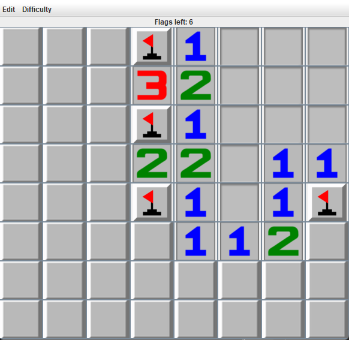

  <h1 align="center">Minesweeper</h1>

  
  
  
  Compile with `sbt compile`, run with `sbt run`

# The Game
* You get a field of squares in which a specific amount of bombs are hidden in.
* After revealing a square it can have one of ten values. Among them are the values 1 to 8, a bomb or just nothing/an empty square.
* A value tells how many bombs there are in the surrounding eight squares. With the help of this you can determine where a bomb must be located.
* If you think you know where a bomb must be, you should mark the square with a flag by right clicking it.
* The goal is to detect every bomb on the field and mark it with a flag but you only have so many flags, as there are bombs.
* If every square is revealed and every flag was set, the game is finished successfully. If you click and reveal a bomb, it explodes and the game is over.

# Pictures
   
